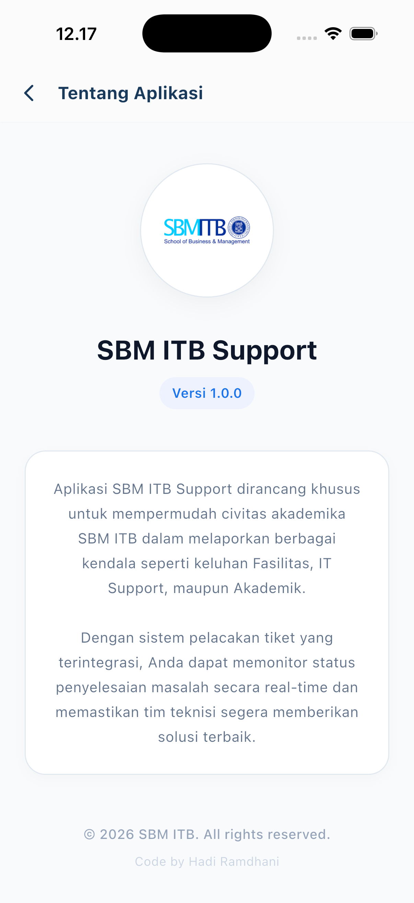
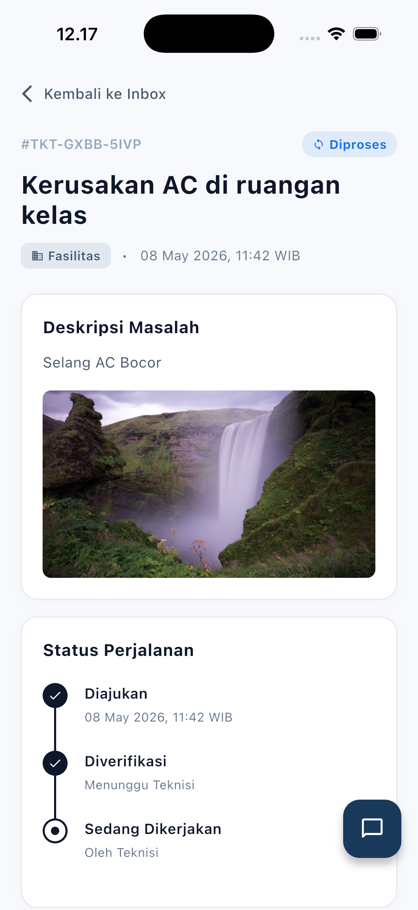
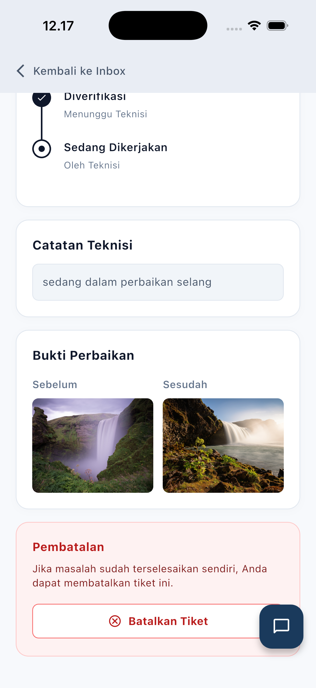
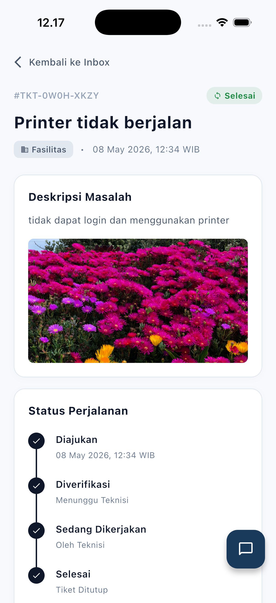

# SBM ITB Ticketing Helpdesk App

[](https://flutter.dev)
[](https://firebase.google.com/)
[](https://github.com/)

**SBM ITB Ticketing App** adalah platform *helpdesk* terintegrasi yang dirancang khusus untuk memenuhi kebutuhan operasional School of Business and Management (SBM) ITB. Aplikasi ini mendigitalisasi proses pelaporan keluhan fasilitas, infrastruktur IT, dan layanan operasional lainnya secara transparan, akuntabel, dan *real-time*.

---

## Arsitektur dan Alur Sistem

Aplikasi ini menggunakan model peran (*Role-Based*) yang terstruktur untuk menjamin efisiensi alur kerja antara pelapor, tim teknis, dan manajemen.


> [!TIP]
> Dokumentasi alur kerja aktor (*Actor Workflow*) yang lebih detail dapat ditemukan pada file: [`diagram/actor_workflow.drawio`](diagram/actor_workflow.drawio)

---

## Pratinjau Antarmuka (Screenshots)

<p align="center">
  
  
  
  
  <br/>
  
  
  
  
</p>

---

## Fitur Utama dan Keunggulan

### Sistem Autentikasi dan Verifikasi Tingkat Tinggi
- **Email Verification via EmailJS**: Menjamin keamanan pendaftaran civitas ITB dengan verifikasi kode OTP (One-Time Password) yang dikirim langsung melalui gateway **EmailJS**.
- **Phone Login Support**: Fleksibilitas login menggunakan nomor telepon yang terverifikasi.
- **RBAC (Role-Based Access Control)**: Pemisahan hak akses yang ketat antara *Requester* (Pelapor), *Technician* (Teknisi), dan *Admin*.

### Manajemen Laporan dan Dokumentasi Visual
- **Penyimpanan Gambar via ImgBB API**: Seluruh lampiran bukti kerusakan dan bukti perbaikan disimpan menggunakan API **ImgBB** untuk menjamin ketersediaan data tanpa membebani database utama.
- **Transparansi Perbaikan (Before & After)**: Teknisi diwajibkan mendokumentasikan kondisi fasilitas sebelum dan sesudah diperbaiki.
- **Real-Time Status Tracking**: Pantau status tiket (Open, In Progress, Resolved) secara langsung dengan *timeline* yang detail.

### Fitur Komunikasi dan Notifikasi Proaktif
- **Real-Time Chat**: Ruang diskusi langsung antara pelapor dan teknisi untuk klarifikasi masalah.
- **Automatic System Notifications**: Notifikasi instan melalui `flutter_local_notifications` saat ada perubahan status atau catatan teknisi baru.
- **System Messaging**: Riwayat pembaruan otomatis yang tercatat dalam ruang obrolan sebagai referensi audit.

---

## Stack Teknologi dan Logika Utama

### 1. Teknologi (Tech Stack)
- **Framework**: Flutter (Dart) - *UI responsif dan performa native.*
- **Backend**: Firebase Cloud Firestore - *Sinkronisasi data real-time.*
- **Authentication**: Firebase Auth & EmailJS - *Verifikasi berlapis.*
- **Media Storage**: ImgBB API - *Penyimpanan foto terpusat.*
- **State Management**: Provider - *Arsitektur yang bersih dan scalable.*

### 2. Algoritma dan Logika Bisnis
- **Role-Based Routing**: Logika pengalihan dashboard otomatis berdasarkan metadata pengguna.
- **Real-time Data Streaming**: Sinkronisasi tiket dan chat tanpa jeda menggunakan Firestore Snapshots.
- **State Comparison Notification**: Algoritma pemantauan perubahan field spesifik untuk memicu notifikasi lokal.
- **Optimistic UI Update**: Pengalaman pengguna yang instan dengan teknik sinkronisasi latar belakang.

---

## Struktur Direktori (Detail)

```text
lib/
├── main.dart                          # Titik masuk aplikasi & konfigurasi Tema Global
├── firebase_options.dart              # Konfigurasi otomatis dari FlutterFire
├── models/
│   ├── message_model.dart             # Model struktur data Pesan Chat
│   ├── ticket_model.dart              # Model struktur data Tiket Keluhan
│   └── user_model.dart                # Model struktur data Pengguna
├── providers/
│   ├── auth_provider.dart             # Mengatur state login/register/logout & autentikasi
│   └── ticket_provider.dart           # Mengatur state list dan filter data tiket
├── services/
│   ├── auth_service.dart              # Logika API Firebase Authentication
│   ├── chat_service.dart              # Logika Database Real-time Chat
│   ├── email_otp_service.dart         # Layanan verifikasi OTP via EmailJS
│   ├── notification_service.dart      # Konfigurasi `flutter_local_notifications`
│   └── ticket_service.dart            # Logika CRUD Firestore & ImgBB Upload
└── screens/
    ├── admin/                         # Modul Pengawas (Dashboard & User Management)
    ├── auth/                          # Modul Login, Register, & OTP (Email/Phone)
    ├── requester/                     # Modul Pelapor (Form & Monitoring)
    ├── technician/                    # Modul Teknisi (Update Status & Evidence)
    ├── shared/                        # Komponen UI Global (Card, Badge, dsb)
    ├── chat_screen.dart               # Layar komunikasi real-time
    ├── dashboard_wrapper.dart         # Router otomatis berdasarkan Role
    ├── help_center_screen.dart        # Pusat bantuan & FAQ
    └── settings_screen.dart           # Pengaturan Profil & Notifikasi
```

---

## Panduan Penggunaan

1. **Clone Repository**: `git clone <repo-url>`
2. **Install Dependencies**: `flutter pub get`
3. **Configure Firebase**: Hubungkan aplikasi dengan proyek Firebase menggunakan `flutterfire configure`.
4. **Environment Setup**: Pastikan API Key ImgBB dan EmailJS telah terkonfigurasi di dalam folder `services/`.
5. **Run Project**: `flutter run`

---

## Catatan Rilis

- **Versi 1.9.1**:
  - Implementasi verifikasi OTP melalui **EmailJS API**.
  - Integrasi **ImgBB API** untuk manajemen penyimpanan foto laporan.
  - Penambahan fitur Catatan Teknisi dan Bukti Perbaikan (Before/After).
  - Peningkatan performa notifikasi lokal pada perangkat Android.
  - Skema Role-Based Access yang telah stabil.

---
**© 2026 SBM ITB** - *Digitalizing Campus Infrastructure Support.*
