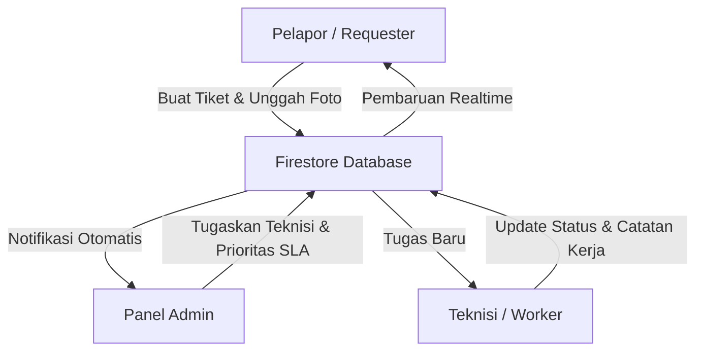
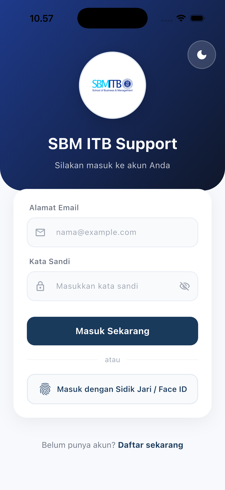
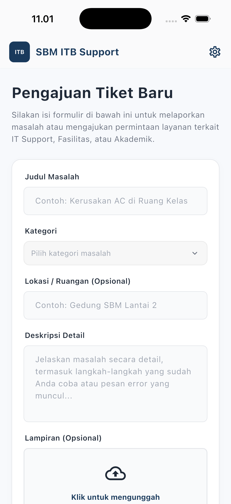
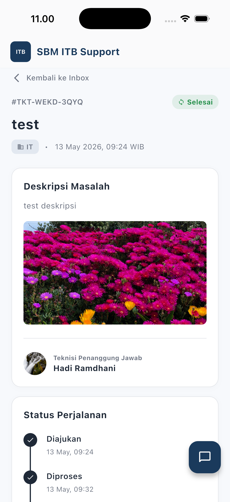
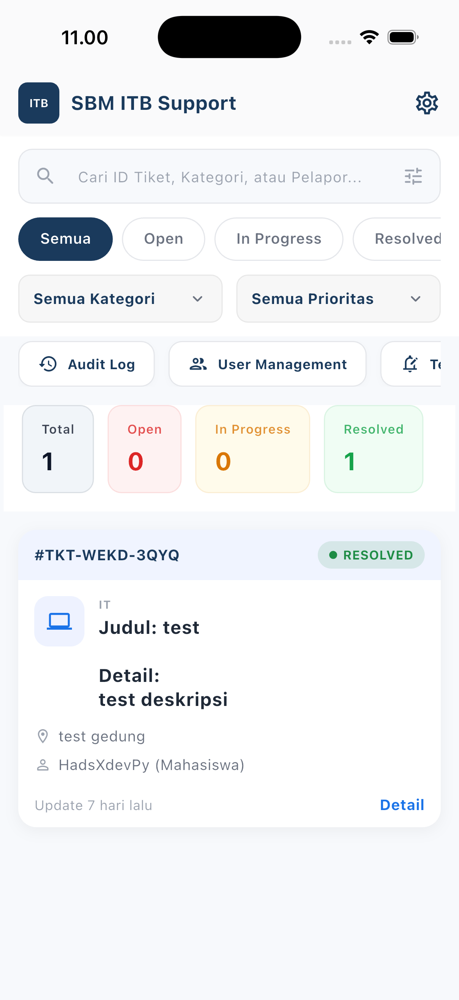
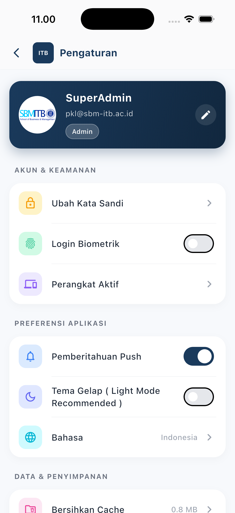
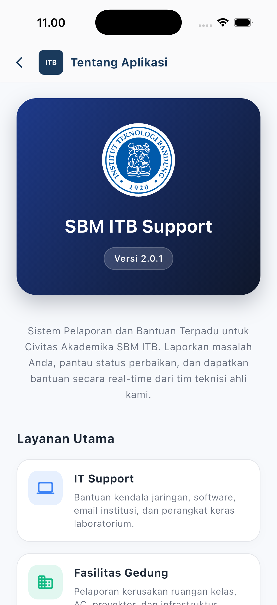
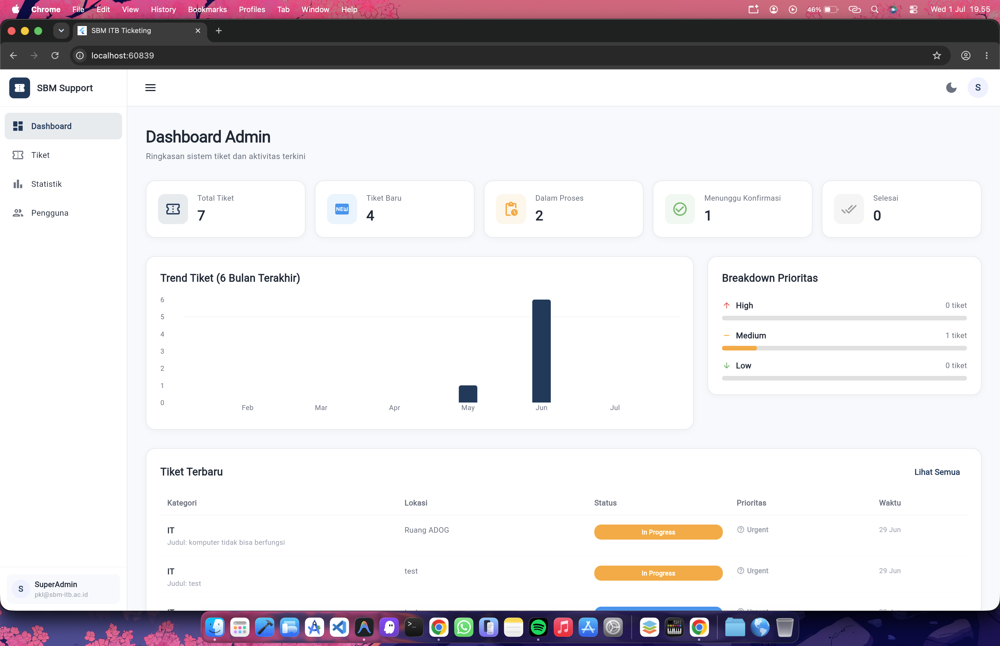

# SBM ITB Ticketing Helpdesk App

<p align="center">
  
</p>

<p align="center">
  <a href="https://flutter.dev"></a>
  <a href="https://firebase.google.com/"></a>
  <a href="https://pub.dev"></a>
  <a href="#"></a>
</p>

---

SBM ITB Ticketing App adalah platform helpdesk terintegrasi yang dirancang khusus untuk memenuhi kebutuhan operasional School of Business and Management (SBM) ITB. Aplikasi ini mendigitalisasi proses pelaporan keluhan fasilitas, infrastruktur IT, dan layanan operasional lainnya secara transparan, akuntabel, dan real-time.

---

## Arsitektur dan Alur Sistem

Aplikasi ini menggunakan model peran (Role-Based) yang terstruktur untuk menjamin efisiensi alur kerja antara pelapor, tim teknis, dan manajemen.



> [!TIP]
> Dokumentasi alur kerja aktor (Actor Workflow) yang lebih detail dapat ditemukan pada file: `diagram/actor_workflow.drawio`

---

## Pratinjau Antarmuka (Screenshots)

Berikut adalah beberapa tampilan utama dari aplikasi helpdesk:

<table align="center">
  <tr>
    <td align="center"><b>Halaman Masuk (Login Screen)</b></td>
    <td align="center"><b>Halaman Permintaan (Request Screen)</b></td>
    <td align="center"><b>Halaman Detail Tiket Admin (Detail Screen)</b></td>
  </tr>
  <tr>
    <td valign="top"></td>
    <td valign="top"></td>
    <td valign="top"></td>
  </tr>
  <tr>
    <td align="center"><b>Halaman Dashboard (Dashboard Screen)</b></td>
    <td align="center"><b>Halaman Pengaturan (Settings Screen)</b></td>
    <td align="center"><b>Halaman Tentang (About Screen)</b></td>
  </tr>
  <tr>
    <td valign="top"></td>
    <td valign="top"></td>
    <td valign="top"></td>
  </tr>
</table>

---

## Fitur Unggulan (Versi 2.1.3)

### Dukungan Multi-Bahasa (Localization)
*   **Dynamic Language Switcher**: Dukungan penuh untuk pergantian bahasa instan (Bahasa Indonesia & English) di seluruh modul aplikasi tanpa memerlukan restart aplikasi.
*   **Dynamic Localization Provider**: Menggunakan `LanguageProvider` terpusat untuk menjamin konsistensi terjemahan pada semua label UI, pesan kesalahan, dialog konfirmasi, dan detail tiket.

### Akses Tamu & Autentikasi Fleksibel (Guest Access)
*   **Anonymous Guest Mode**: Pelapor dapat masuk ke aplikasi secara anonim untuk mengajukan keluhan darurat dan memantau status tiket tanpa harus mendaftar akun terlebih dahulu.
*   **Seamless Chat Integration**: Hubungan langsung ke saluran komunikasi chat dengan teknisi/admin secara otomatis untuk pengguna tamu demi respon cepat.

### Desain Premium & Animasi High-Fidelity
*   **Premium Page Route Transitions**: Navigasi halaman antar-layar menggunakan custom `PremiumPageRoute` untuk transisi animasi geser dan pudar yang sangat halus (smooth transition).
*   **Animated Splash Screen**: Layar selamat datang modern yang menampilkan logo ITB dengan efek animasi premium.
*   **iOS Liquid Glass Dropdown**: Komponen dropdown kustom dengan efek blur dinamis (Glassmorphism) serta transisi rotasi ikon chevron yang presisi.
*   **Staggered Entrance Transitions**: Animasi masuk daftar tiket secara bertahap pada halaman pengaju dan teknisi untuk meningkatkan estetika visual.
*   **Tactile Stats Counter**: Animasi perubahan angka statistik interaktif menggunakan transisi slide dan fade.
*   **Backdrop Blur UI Details**: Action menu pada detail tiket admin dilengkapi dengan blur latar belakang (backdrop blur) dan visual elegan.

### Sistem Keamanan, Audit & Escalation
*   **Automated Ticket Escalation**: Mesin otomatis untuk eskalasi prioritas tiket dan penyesuaian deadline target SLA berdasarkan tingkat urgensi.
*   **Audit Log System**: Pencatatan aktivitas administratif secara otomatis pada Firestore (misal: penghapusan tiket, perubahan peran, pembaruan SLA, serta modifikasi tiket) untuk transparansi penuh.
*   **Ticket Modification by Admin**: Kemampuan bagi administrator untuk mengedit langsung rincian tiket (kategori, prioritas, judul, deskripsi, lokasi) dengan pencatatan log otomatis.
*   **Resolved State Locking**: Penguncian data tiket yang telah selesai (Resolved) agar tidak dapat diubah kembali oleh teknisi untuk menjaga integritas data.
*   **Admin Impersonation**: Fitur simulasi peran bagi administrator untuk mempermudah pemecahan masalah langsung di lingkungan produksi.

### Laporan, Manajemen Data & Inventaris
*   **Ekspor Laporan**: Pengunduhan laporan data tiket dalam format Excel dan CSV dengan saringan rentang tanggal.
*   **Pemantauan SLA**: Pelacakan penyelesaian kendala berdasarkan tingkat prioritas layanan.
*   **Priority-Based Submission**: Pelapor dapat menentukan tingkat urgensi tiket (Low, Medium, High, Urgent) saat membuat tiket untuk penanganan lebih efisien.
*   **Simulasi Laporan Terjadwal**: Pengaturan waktu kirim laporan mingguan atau bulanan otomatis.
*   **Device Inventory & Biometrics**: Modul pelacakan perangkat pengguna (My Devices) terintegrasi dengan opsi keamanan Biometrik (FaceID/TouchID).
*   **Legacy Image Compatibility**: Mekanisme fallback otomatis untuk memuat gambar dari data versi terdahulu (imageUrl/image) guna menjaga konsistensi tampilan.

### Komunikasi & Kolaborasi
*   **Catatan Internal**: Fitur diskusi tertutup khusus bagi admin dan teknisi yang tidak terlihat oleh pelapor.
*   **Timeline Terpadu**: Riwayat perkembangan tiket secara kronologis dari awal hingga selesai secara transparan.

---

## Stack Teknologi

| Komponen | Teknologi | Deskripsi |
| :--- | :--- | :--- |
| **Framework** | Flutter (Dart >= 3.10) | Aplikasi multiplatform performa tinggi dengan transisi premium. |
| **Database & Auth** | Firebase Suite | Firestore Realtime Database, Firebase Auth, Cloud Storage, & FCM. |
| **Penyimpanan Media** | ImgBB | API eksternal untuk menyimpan foto bukti keluhan secara cloud. |
| **Sistem OTP & Email** | EmailJS | Autentikasi OTP email yang aman dan cepat. |
| **Manajemen Status** | Provider | Arsitektur state management bersih, responsif, dan terstruktur. |
| **Keamanan Lokal** | Local Auth | Integrasi otentikasi biometrik bawaan OS (Touch ID/Face ID). |

---

## Modul Web Responsif (Panel Admin & Operasional)

<p align="center">
  
</p>

Aplikasi SBM ITB Ticketing juga dilengkapi dengan modul berbasis web yang dioptimalkan untuk performa desktop, tablet, dan mobile. Halaman utama web dialihkan secara otomatis berdasarkan peran pengguna melalui `WebWrapper`.

### Tata Letak Responsif (Breakpoints)
*   **Desktop (`≥ 900px`)**: Sidebar navigasi persisten di sebelah kiri, toolbar atas dengan opsi ganti tema dan menu profil.
*   **Tablet (`600px - 899px`)**: AppBar atas dilengkapi drawer navigasi geser kiri yang dinamis.
*   **Mobile (`< 600px`)**: Bilah navigasi bawah (*Bottom Navigation Bar*) yang efisien.

### Fitur Halaman Web
1.  **Halaman Login Admin (`web_admin_login_screen.dart`)**: Proses masuk aman dengan pemeriksaan peran admin di Firestore, serta desain Glassmorphic biru premium.
2.  **Dashboard Utama (`web_admin_dashboard_screen.dart`)**: Ringkasan performa sistem lewat kartu statistik, grafik tren bulanan (`fl_chart`), breakdown prioritas tiket, serta daftar 10 tiket terbaru.
3.  **Manajemen Pengguna (`web_admin_users_screen.dart`)**: CRUD lengkap (Tambah, Edit Peran, Hapus) yang terintegrasi dengan Firestore database dan pencatatan audit log otomatis.
4.  **Manajemen Tiket (`web_admin_tickets_screen.dart`)**: Pelacakan daftar pengaduan secara real-time dan penyaringan status tiket.
5.  **Visualisasi SLA (`web_admin_stats_screen.dart`)**: Grafik kinerja target waktu penyelesaian pengaduan.

---

## Struktur Direktori Utama

```text
lib/
├── models/
│   ├── message_model.dart             # Skema data pesan chat
│   ├── ticket_model.dart              # Skema data tiket & SLA logic
│   └── user_model.dart                # Skema data profil pengguna & role
├── providers/
│   ├── auth_provider.dart             # State management user & session
│   ├── language_provider.dart         # State management lokalisasi (Indonesian/English)
│   ├── theme_provider.dart            # State management tema gelap/terang & visual
│   └── ticket_provider.dart           # State management list & filters
├── services/
│   ├── audit_service.dart             # Layanan pencatatan aktivitas admin
│   ├── auth_service.dart              # Layanan autentikasi email & Google Sign-In
│   ├── biometric_service.dart         # Layanan otentikasi biometrik perangkat
│   ├── chat_service.dart              # Layanan komunikasi chat real-time
│   ├── device_service.dart            # Layanan inventaris perangkat pengguna
│   ├── email_otp_service.dart         # Layanan pengiriman kode OTP via EmailJS
│   ├── notification_service.dart      # Notifikasi lokal & FCM setup
│   └── ticket_service.dart            # CRUD Firestore, image upload & escalation logic
└── screens/
    ├── admin/                         # Modul Pengawas & Manajerial (Audit Log, Export, Stats)
    ├── auth/                          # Modul Otentikasi (Login, Phone Login, OTP)
    ├── requester/                     # Modul Pelapor (User End)
    ├── technician/                    # Modul Perbaikan (Worker End / Technician)
    ├── web/                           # Modul Web Responsif (Admin Dashboard, Stats, Users, Tickets)
    └── shared/                        # Komponen Reusable UI (Dropdown, Impersonation Banner, Ticket Card)
```

---

## Panduan Instalasi

1.  **Clone repositori:**
    ```bash
    git clone https://github.com/0xHadiRamdhani/sbm-ticketing-app
    ```
2.  **Dapatkan dependensi proyek:**
    ```bash
    flutter pub get
    ```
3.  **Konfigurasi backend:**
    *   Siapkan konfigurasi Firebase Anda dan jalankan perintah inisialisasi untuk membuat berkas `lib/firebase_options.dart`.
4.  **Konfigurasi OTP:**
    *   Konfigurasikan API Key EmailJS Anda pada berkas `lib/services/email_otp_service.dart`.
5.  **Jalankan aplikasi:**
    ```bash
    flutter run
    ```

---

## Riwayat Rilis

*   **Versi 2.1.3 (Terbaru)**:
    *   Penambahan opsi pemilihan tingkat prioritas tiket (Low, Medium, High, Urgent) saat pembuatan tiket baru oleh pelapor.
    *   Fitur modifikasi detail tiket (kategori, prioritas, judul, deskripsi, lokasi) oleh administrator langsung dari panel detail.
    *   Integrasi audit log otomatis untuk mencatat riwayat perubahan isi tiket oleh administrator.
    *   Penerapan mekanisme fallback pembacaan properti gambar lama (imageUrl/image) untuk seluruh peran.
*   **Versi 2.1.2**:
    *   Android and iOS build optimization (migrasi Kotlin `compilerOptions` DSL dan `FlutterImplicitEngineDelegate` iOS).
    *   Pembaruan SDK minimal Dart menjadi `3.10.0-0`.
    *   Pembaruan pustaka dependensi ke versi terbaru (Firebase Core, Auth, Firestore, dll).
*   **Versi 2.1.1**:
    *   Integrasi multi-language support (Bahasa Indonesia & English) di seluruh layar aplikasi.
    *   Dukungan mode masuk tamu anonim (Guest Mode) dengan akses langsung ke obrolan bantuan.
    *   Sistem eskalasi tiket otomatis (`automated ticket escalation`) berbasis SLA.
    *   Pembaruan visual premium: layar splash animasi, dan `PremiumPageRoute` transition.
*   **Versi 2.1.0**:
    *   Penerapan desain Glassmorphic iOS Liquid Glass Dropdown di seluruh aplikasi.
    *   Penerapan animasi transisi masuk staggered untuk daftar tiket dan kartu statistik.
*   **Versi 2.0.1**:
    *   Pembaruan rutin, kompatibilitas tema gelap (Dark Mode) adaptif, dan optimalisasi performa.
*   **Versi 2.0.0**:
    *   Audit Log, SLA Monitoring, Export Reporting, dan Resolved Locking.
*   **Versi 1.9.1**:
    *   Integrasi EmailJS OTP dan ImgBB Media Storage.

---

**Copyright (c) 2026 SBM ITB** - *Modernizing Campus Infrastructure Support.*
