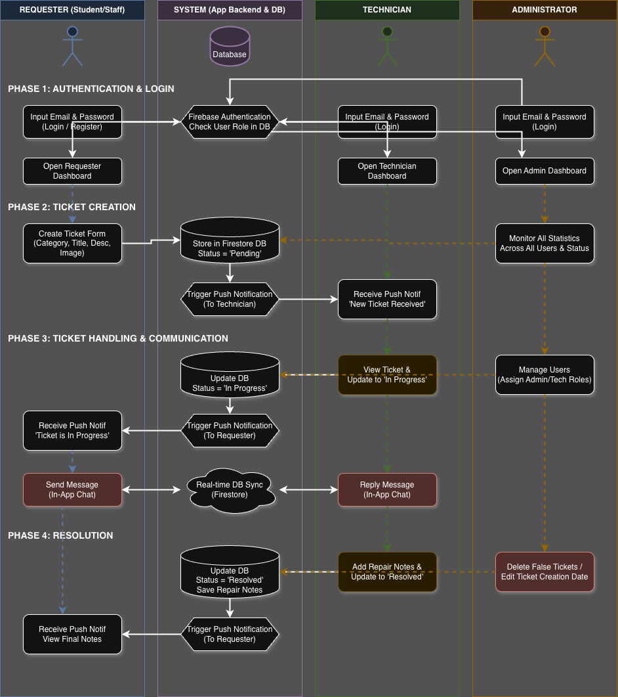
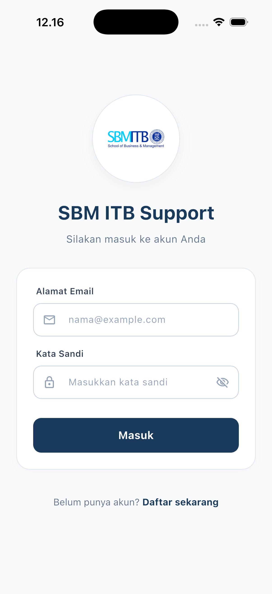
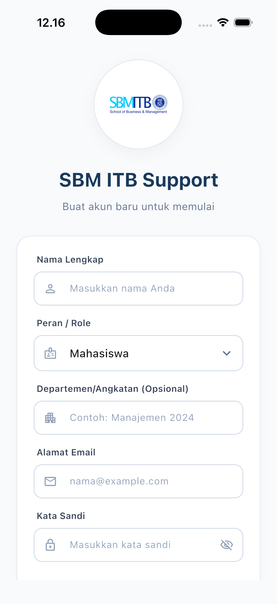
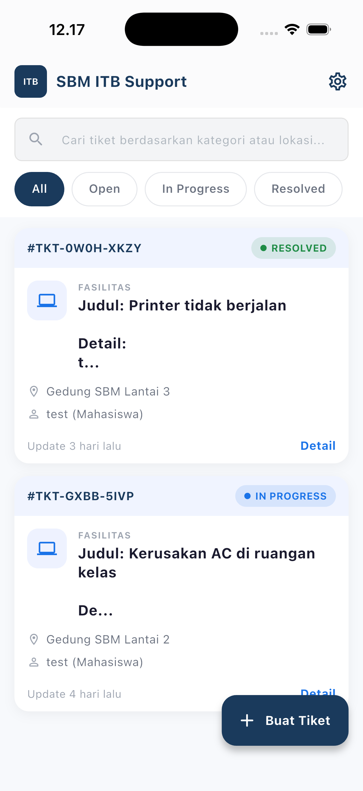
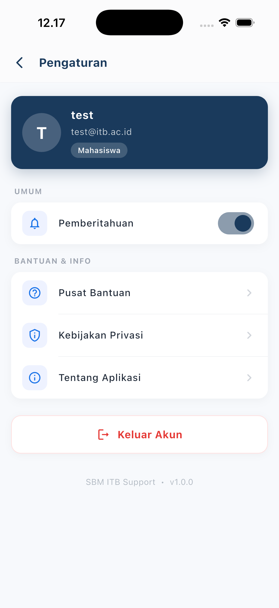

# SBM ITB Ticketing Helpdesk App

[](https://flutter.dev)
[](https://firebase.google.com/)
[](https://github.com/)

**SBM ITB Ticketing App** adalah platform *helpdesk* terintegrasi yang dirancang khusus untuk memenuhi kebutuhan operasional School of Business and Management (SBM) ITB. Aplikasi ini mendigitalisasi proses pelaporan keluhan fasilitas, infrastruktur IT, dan layanan operasional lainnya secara transparan, akuntabel, dan *real-time*.

---

## Arsitektur dan Alur Sistem

Aplikasi ini menggunakan model peran (*Role-Based*) yang terstruktur untuk menjamin efisiensi alur kerja antara pelapor, tim teknis, dan manajemen.



> [!TIP]
> Dokumentasi alur kerja aktor (*Actor Workflow*) yang lebih detail dapat ditemukan pada file: [`diagram/actor_workflow.drawio`](diagram/actor_workflow.drawio)

---

## Pratinjau Antarmuka (Screenshots)

<p align="center">
  
  
  
  
</p>

---

## Fitur Unggulan (Versi 2.0)

### 🛡️ Sistem Keamanan & Audit
- **Audit Log System**: Pencatatan otomatis seluruh aksi administratif (update massal, penghapusan, perubahan role) untuk transparansi operasional.
- **Resolved State Locking**: Proteksi integritas data di mana teknisi tidak dapat mengubah foto atau catatan setelah tiket dinyatakan *Resolved*.
- **Admin Impersonation**: Fitur pengujian bagi admin untuk melihat perspektif pengguna lain secara aman.

### 📊 Manajemen Data & Laporan (Reporting)
- **Export to Excel/CSV**: Fitur ekspor laporan tiket secara instan dengan filter tanggal dan kategori.
- **SLA Monitoring**: Pelacakan batas waktu penyelesaian (Service Level Agreement) berdasarkan tingkat prioritas (Critical, High, Medium, Low).
- **Scheduled Reports Simulation**: Antarmuka untuk pengaturan pengiriman laporan otomatis (Mingguan/Bulanan).

### ⚙️ Administrasi Tingkat Lanjut
- **Notification Template Manager**: Kelola konten notifikasi sistem (email/app) secara dinamis tanpa mengubah kode sumber.
- **Bulk Operations**: Kemampuan untuk menyelesaikan atau menghapus banyak tiket sekaligus dalam satu aksi massal.
- **Advanced Dashboard Stats**: Visualisasi data statistik performa helpdesk secara komprehensif.

### 💬 Komunikasi & Kolaborasi
- **Internal Notes (Staff Only)**: Catatan rahasia antar Admin dan Teknisi yang tidak terlihat oleh Pelapor.
- **Unified Timeline**: Riwayat perjalanan tiket yang sinkron di semua role secara kronologis (Ascending).

---

## Stack Teknologi

- **Framework**: Flutter (Dart)
- **Backend**: Firebase Cloud Firestore & Authentication
- **External APIs**: 
  - **ImgBB**: Media Storage (Bukti Foto)
  - **EmailJS**: OTP & Email System
- **Key Libraries**:
  - `excel` & `share_plus`: Reporting & Sharing
  - `intl`: Localization & Date Formatting
  - `provider`: State Management

---

## Struktur Direktori

```text
lib/
├── models/
│   ├── ticket_model.dart              # Skema data tiket & SLA logic
│   └── audit_log_model.dart           # Skema data aktivitas admin
├── providers/
│   ├── auth_provider.dart             # State management user & session
│   └── ticket_provider.dart           # State management list & filters
├── services/
│   ├── audit_service.dart             # Layanan pencatatan aktivitas
│   ├── export_service.dart            # Generator file laporan Excel/CSV
│   ├── notification_service.dart      # Notifikasi lokal & FCM setup
│   └── ticket_service.dart            # CRUD Firestore & Image upload
└── screens/
    ├── admin/                         # Modul Pengawas & Manajerial
    │   ├── audit_log_screen.dart      # Monitoring log sistem
    │   ├── export_reports_screen.dart # Fitur unduh & jadwal laporan
    │   └── notification_templates_screen.dart # Editor templat sistem
    ├── requester/                     # Modul Pelapor (User End)
    ├── technician/                    # Modul Perbaikan (Worker End)
    └── shared/                        # Komponen Reusable UI
```

---

## Panduan Instalasi

1. `git clone https://github.com/0xHadiRamdhani/sbm-ticketing-app`
2. `flutter pub get`
3. Konfigurasi `firebase_options.dart` sesuai proyek Firebase Anda.
4. Setup `services/email_otp_service.dart` dengan API Key EmailJS Anda.
5. Jalankan: `flutter run`

---

## Riwayat Rilis

- **Versi 2.0.0 (Latest)**: 
  - Audit Log, SLA Monitoring, Export Reporting, dan Resolved Locking.
- **Versi 1.9.1**: 
  - Integrasi EmailJS OTP dan ImgBB Media Storage.

---
**© 2026 SBM ITB** - *Modernizing Campus Infrastructure Support.*
