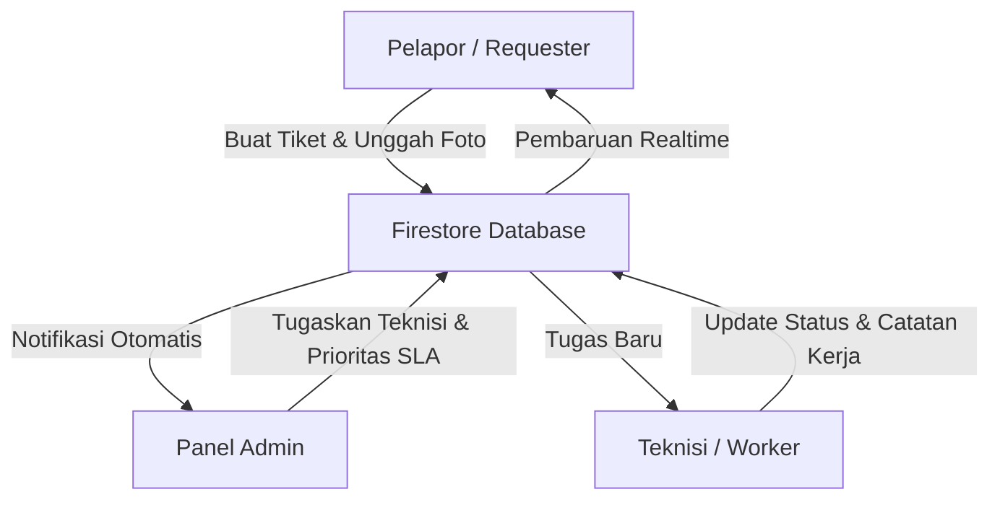

# SBM ITB Ticketing Helpdesk App

<p align="center">
  
</p>

<p align="center">
  <a href="https://flutter.dev"></a>
  <a href="https://firebase.google.com/"></a>
  <a href="https://pub.dev"></a>
  <a href="#"></a>
</p>

---

**SBM ITB Ticketing App** adalah platform *helpdesk* terintegrasi yang dirancang khusus untuk memenuhi kebutuhan operasional School of Business and Management (SBM) ITB. Aplikasi ini mendigitalisasi proses pelaporan keluhan fasilitas, infrastruktur IT, dan layanan operasional lainnya secara transparan, akuntabel, dan *real-time*.

---

## 🗺️ Arsitektur dan Alur Sistem

Aplikasi ini menggunakan model peran (*Role-Based*) yang terstruktur untuk menjamin efisiensi alur kerja antara pelapor, tim teknis, dan manajemen.



> [!TIP]
> Dokumentasi alur kerja aktor (*Actor Workflow*) yang lebih detail dapat ditemukan pada file: [`diagram/actor_workflow.drawio`](diagram/actor_workflow.drawio)

---

## 🎨 Pratinjau Antarmuka (Screenshots)

<p align="center">
  
  
  
  
</p>

---

## ✨ Fitur Unggulan (Versi 2.1.0)

### 🎨 Premium UI/UX & High-Fidelity Animations (New)
*   **iOS Liquid Glass Dropdown**: Komponen dropdown khusus dengan efek *backdrop blur* dinamis (Glassmorphic) dan transisi rotasi ikon *chevron* 180 derajat yang mulus.
*   **Staggered Entrance Transitions**: Animasi pemuatan data (*fade-in* & *slide-up*) bertahap pada daftar tiket di Dashboard Pengaju dan Teknisi.
*   **Tactile Stats Counter**: Animasi penghitung dinamis menggunakan `AnimatedSwitcher` yang meluncur dan memudar saat angka statistik berubah.

### 🛡️ Sistem Keamanan & Audit
*   **Audit Log System**: Pencatatan otomatis seluruh aksi administratif (update massal, penghapusan, perubahan role) untuk transparansi operasional.
*   **Resolved State Locking**: Proteksi integritas data di mana teknisi tidak dapat mengubah foto atau catatan setelah tiket dinyatakan *Resolved*.
*   **Admin Impersonation**: Fitur pengujian bagi admin untuk melihat perspektif pengguna lain secara aman.

### 📊 Manajemen Data & Laporan (Reporting)
*   **Export to Excel/CSV**: Fitur ekspor laporan tiket secara instan dengan filter tanggal dan kategori.
*   **SLA Monitoring**: Pelacakan batas waktu penyelesaian (Service Level Agreement) berdasarkan tingkat prioritas (Critical, High, Medium, Low).
*   **Scheduled Reports Simulation**: Antarmuka untuk pengaturan pengiriman laporan otomatis (Mingguan/Bulanan).

### 💬 Komunikasi & Kolaborasi
*   **Internal Notes (Staff Only)**: Catatan rahasia antar Admin dan Teknisi yang tidak terlihat oleh Pelapor.
*   **Unified Timeline**: Riwayat perjalanan tiket yang sinkron di semua role secara kronologis (Ascending).

---

## 🛠️ Stack Teknologi

| Komponen | Teknologi | Deskripsi |
| :--- | :--- | :--- |
| **Framework** | Flutter (Dart) | Aplikasi multiplatform dengan performa tinggi. |
| **Database & Auth** | Firebase | Penyimpanan realtime Firestore dan Autentikasi Pengguna. |
| **Penyimpanan Media** | ImgBB | API eksternal untuk menyimpan foto bukti keluhan. |
| **Sistem OTP & Email** | EmailJS | Autentikasi OTP email yang aman dan cepat. |
| **Manajemen Status** | Provider | Arsitektur state management yang bersih dan terstruktur. |

---

## 📂 Struktur Direktori Utama

```text
lib/
├── models/
│   ├── ticket_model.dart              # Skema data tiket & SLA logic
│   └── audit_log_model.dart           # Skema data aktivitas admin
├── providers/
│   ├── auth_provider.dart             # State management user & session
│   └── ticket_provider.dart           # State management list & filters
├── services/
│   ├── audit_service.dart             # Layanan pencatatan aktivitas
│   ├── export_service.dart            # Generator file laporan Excel/CSV
│   ├── notification_service.dart      # Notifikasi lokal & FCM setup
│   └── ticket_service.dart            # CRUD Firestore & Image upload
└── screens/
    ├── admin/                         # Modul Pengawas & Manajerial
    │   ├── audit_log_screen.dart      # Monitoring log sistem
    │   ├── export_reports_screen.dart # Fitur unduh & jadwal laporan
    │   └── notification_templates_screen.dart # Editor templat sistem
    ├── requester/                     # Modul Pelapor (User End)
    ├── technician/                    # Modul Perbaikan (Worker End)
    └── shared/                        # Komponen Reusable UI (e.g. IosGlassDropdown)
```

---

## 🚀 Panduan Instalasi

1.  **Clone repositori:**
    ```bash
    git clone https://github.com/0xHadiRamdhani/sbm-ticketing-app
    ```
2.  **Dapatkan dependensi proyek:**
    ```bash
    flutter pub get
    ```
3.  **Konfigurasi backend:**
    *   Siapkan konfigurasi Firebase Anda dan jalankan perintah inisialisasi untuk membuat berkas `lib/firebase_options.dart`.
4.  **Konfigurasi OTP:**
    *   Konfigurasikan API Key EmailJS Anda pada berkas `lib/services/email_otp_service.dart`.
5.  **Jalankan aplikasi:**
    ```bash
    flutter run
    ```

---

## 📋 Riwayat Rilis

*   **Versi 2.1.0 (Terbaru)**:
    *   Penerapan desain Glassmorphic iOS Liquid Glass Dropdown di seluruh aplikasi.
    *   Penerapan animasi transisi masuk staggered untuk daftar tiket dan kartu statistik.
*   **Versi 2.0.1**:
    *   Pembaruan rutin, kompatibilitas tema gelap (Dark Mode) adaptif, dan optimalisasi performa.
*   **Versi 2.0.0**:
    *   Audit Log, SLA Monitoring, Export Reporting, dan Resolved Locking.
*   **Versi 1.9.1**:
    *   Integrasi EmailJS OTP dan ImgBB Media Storage.

---

**© 2026 SBM ITB** - *Modernizing Campus Infrastructure Support.*
